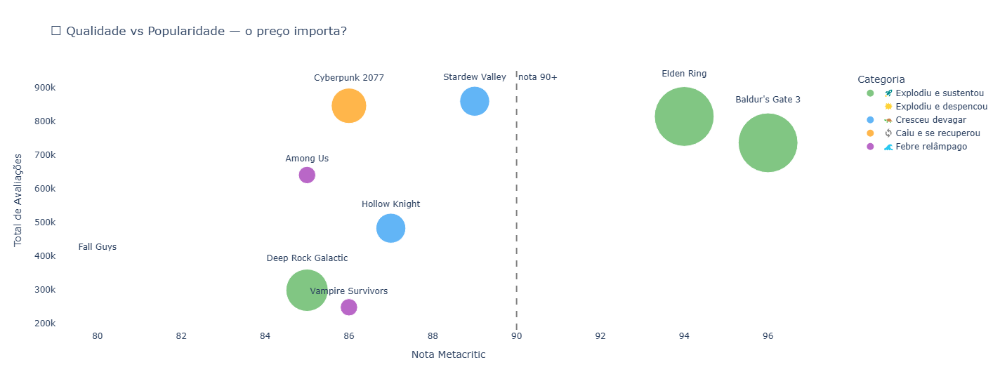
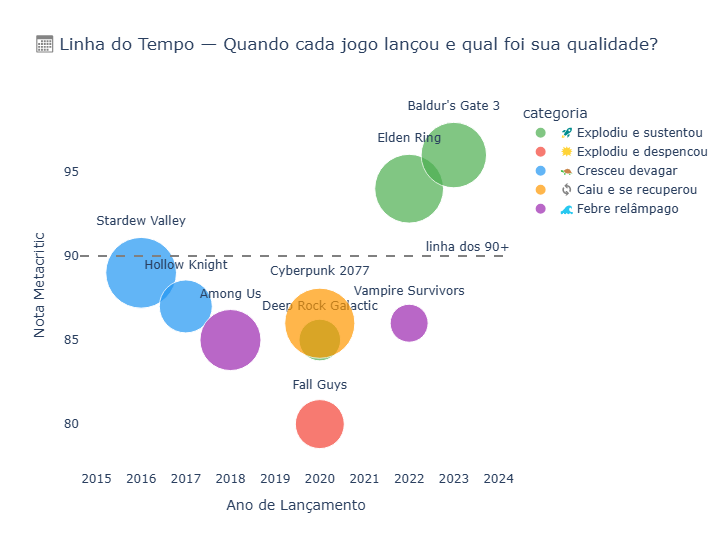
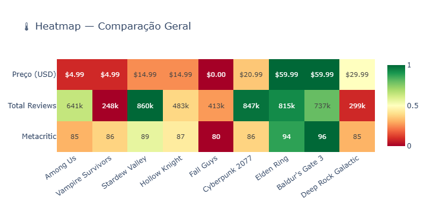
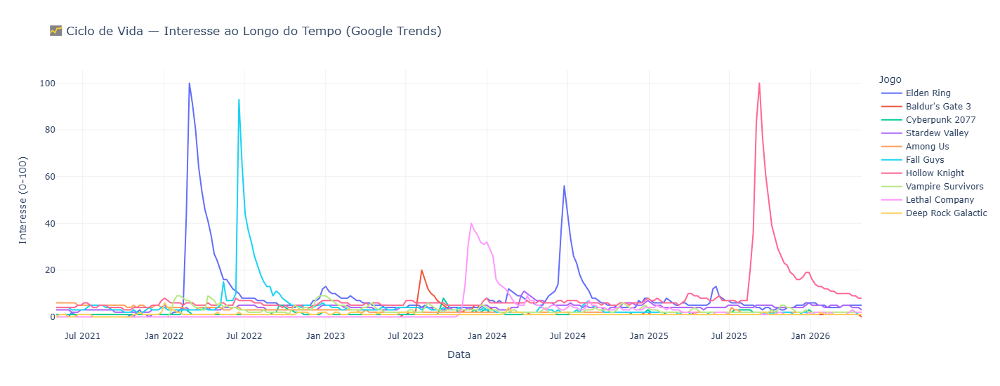
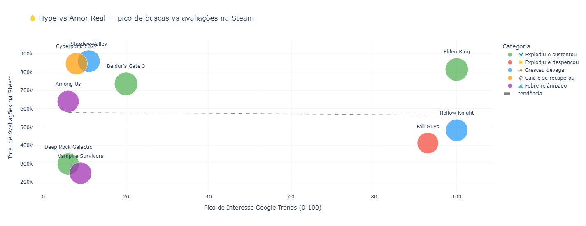

# 🎮 O Ciclo de Vida de um Jogo Viral

> Hype passa, mas alguns jogos ficam. Esse projeto analisa dados reais de 12 jogos para entender o que diferencia os que sustentam dos que despencam.

## 🎯 Motivação

Todo mundo já viu isso acontecer. Um jogo lança, o mundo inteiro está jogando e três meses depois ninguém mais lembra. Mas alguns jogos fazem o caminho inverso: lançam quietinhos, crescem devagar e cinco anos depois ainda estão na lista dos mais jogados da Steam.

Resolvi parar de especular e fui olhar os dados.

## 📊 O que foi analisado

Cruzei dados de **Steam API** e **Google Trends** de 12 jogos lançados entre 2016 e 2023, comparando quatro métricas: nota no Metacritic, total de avaliações na Steam, preço atual e interesse de busca ao longo do tempo.

Os jogos foram divididos em cinco categorias:

| Categoria | Jogos |
|---|---|
| 🚀 Explodiu e sustentou | Elden Ring, Baldur's Gate 3, Deep Rock Galactic |
| 💥 Explodiu e despencou | Fall Guys, Battlefield 2042, Knockout City |
| 🐢 Cresceu devagar | Stardew Valley, Hollow Knight |
| 🔄 Caiu e se recuperou | Cyberpunk 2077 |
| 🌊 Febre relâmpago | Among Us, Vampire Survivors, Lethal Company |

## 📈 Gráficos gerados

## 🛠️ Tecnologias utilizadas

- **Python** — linguagem principal
- **Pandas** — manipulação e limpeza dos dados
- **Plotly** — visualizações interativas
- **Steam API** — dados de jogos, preços, notas e reviews
- **Google Trends via pytrends** — interesse de busca ao longo do tempo
- **Google Colab** — ambiente de desenvolvimento

## 🔍 Principais descobertas

- Stardew Valley, um indie de R$7 desenvolvido por uma única pessoa, lidera em número de avaliações na Steam
- Hype alto no Google Trends não garante engajamento real — a correlação existe mas é fraca
- 2020 foi o ano mais caótico: Fall Guys, Cyberpunk 2077, Among Us e Deep Rock Galactic lançaram no mesmo ano com destinos completamente diferentes
- Hollow Knight, lançado em 2017, atingiu pico 100 no Trends anos depois por causa do anúncio de Silksong

## 📝 Artigo completo

O estudo completo com análise e conclusões está publicado no Medium:

[🔗 Leia o artigo completo aqui](https://medium.com/p/aac22270c011)

## 📁 Arquivos

- `game_hype_cycle.ipynb` — notebook completo com todo o código
- `imagens/` — pasta com os 6 gráficos gerados
